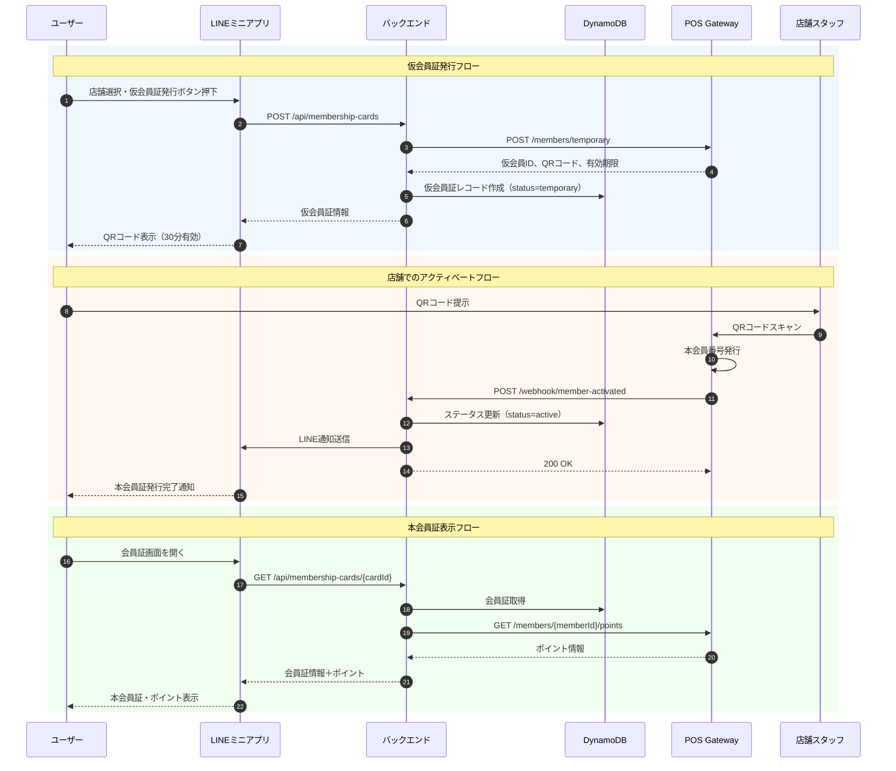
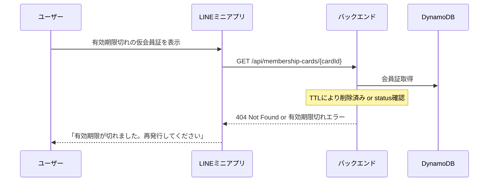
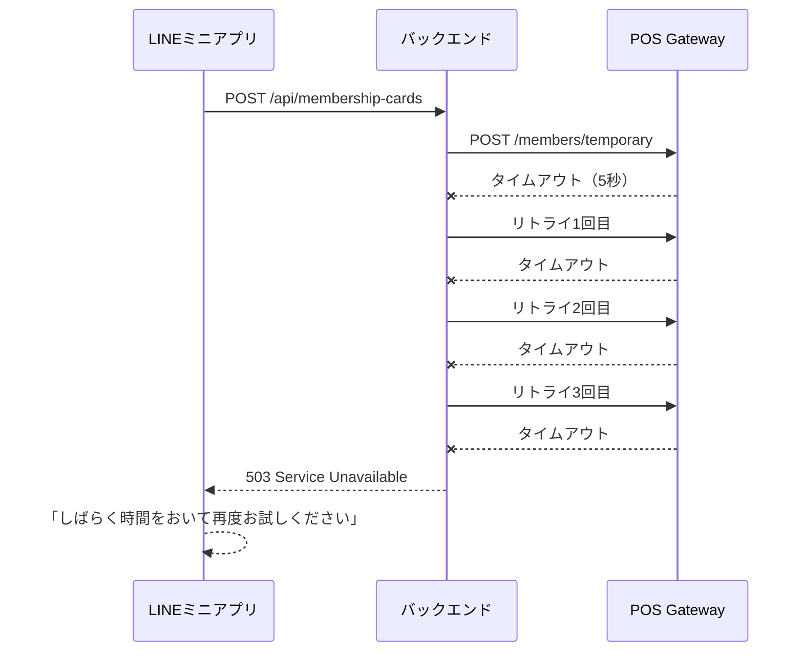

# 会員アクティベートシーケンス図

## 概要

仮会員証発行から本会員証へのアクティベートまでの処理フローを記載します。

## シーケンス図

## 処理説明

### 1. 仮会員証発行フロー

1. ユーザーがLINEミニアプリで店舗を選択し、仮会員証発行ボタンを押下
2. バックエンドがPOS Gatewayに仮会員登録をリクエスト
3. POS Gatewayが仮会員IDとQRコードを発行（有効期限30分）
4. バックエンドがDynamoDBに仮会員証レコードを作成（status=temporary）
5. ユーザーにQRコードを表示

### 2. 店舗でのアクティベートフロー

1. ユーザーが店舗でQRコードを店舗スタッフに提示
2. 店舗スタッフがPOS端末でQRコードをスキャン
3. POSシステムが本会員番号を発行
4. POS GatewayがWebhookでバックエンドにアクティベート完了を通知
5. バックエンドがDynamoDBのステータスを更新（status=active）
6. ユーザーにLINE通知で本会員証発行完了を通知

### 3. 本会員証表示フロー

1. ユーザーが会員証画面を開く
2. バックエンドがDynamoDBから会員証情報を取得
3. バックエンドがPOS Gatewayからポイント情報をリアルタイム取得
4. ユーザーに本会員証とポイント情報を表示

## 例外処理

### 仮会員証有効期限切れ

### POS接続エラー

